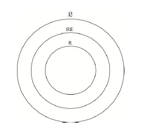
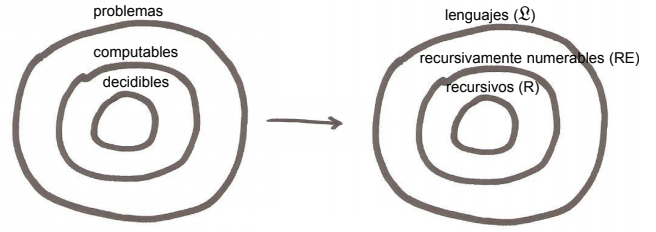
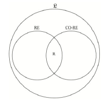
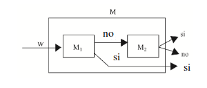

# Práctica 2 - Jerarquía de la Computabilidad.

## Ejercicio 1. Responder brevemente los siguientes incisos:

### 1. ¿En qué difiere un lenguaje recursivo de un lenguaje recursivamente numerable no recursivo?

Si un lenguaje es *recursivamente numerable* (L ∈ RE), no podemos asegurar que la máquina que lo reconoce ante una entrada se detenga. Es decir, frente a un input puede detenerse en su estado qA, detenerse en su estado qR o loopear. Vale aclarar que si queda loopeando quiere decir que no acepta el input. El nombre "recursivamente numerable" se refiere a que las cadenas de esos lenguajes se pueden enumerar.

- Si w ∈ L, entonces ML a partir de w para en su estado qA
- Si w ∉ L, entonces ML a partir de w para en su estado qR o no para

Si un lenguaje es *recursivo* (L ∈ R), la máquina de Turing que lo reconoce frente a una entrada que pertenece a dicho lenguaje, acepta y se detiene, y frente a una entrada que no pertenece a dicho lenguaje, se detiene y rechaza. Es decir, siempre se detiene:

- Si w ∈ L, entonces ML a partir de w para en su estado qA
- Si w ∉ L, entonces ML a partir de w para en su estado qR

### 2. ¿En qué difiere un lenguaje recursivamente numerable de uno que no lo es?

Los lenguajes no recursivamente numerables no son reconocidos por una MT.

### 3. Probar que R ⊆ RE ⊆ L.

Como vemos, en R están los problemas decidibles (es decir, los lenguajes para los cuales existe una máquina que decide por "si" o por "no"). En RE están los lenguajes que tienen una máquina asociada la cual los acepta pero no siempre puede decir que no, dado que aveces loopea. 

Los lenguajes que están en R también están en RE; son un subconjunto dentro de RE.

Por último, L engloba a todos los lenguajes.

### 4. ¿Cuándo un lenguaje está en la clase CO-RE? ¿Puede un lenguaje estar al mismo tiempo en la clase RE y en la clase CO-RE? ¿Para todo lenguaje de la clase CO-RE existe una MT que lo acepta?

Sea CO-RE la clase de los lenguajes complemento, con respecto a Ʃ*, de los lenguajes recursivamente numerables. Formalmente: CO-RE = {L | L ∈ L' ∧ L^C ∈ RE}, donde L' representa a todos los lenguajes.
Considerando CO-RE, la siguiente figura muestra una versión más detallada de la jerarquía de la computabilidad:

De la figura se desprende que un lenguaje L es recursivo si y sólo si tanto L como L^C son recursivamente numerables. Los lenguajes R son los que están al mismo tiempo en la clase RE y la clase CO-RE.

- R es un conjunto de lenguajes que son decidibles por MT. Dice "si" o "no" (para siempre).
- RE es un conjunto de lenguajes que ante una entrada que acepta dice que "si", pero ante una entrada que no acepta puede loopear o decir "no".
- Entonces, podemos afirmar que CO-RE es un conjunto de lenguajes que ante una entrada puede responder "No" (es decir, el input NO es aceptado), o puede loopear o decir "si".

##### Nota: L^C = Complemento de L.

### 5. Justificar por qué los lenguajes Ʃ* y ∅ son recursivos.

Volviendo a la definición de lenguaje recursivo:

Un lenguaje L es recursivo (L ∈ R) si y sólo si existe una MT M que lo acepta y para siempre (también se puede decir directamente que lo decide). Por lo tanto, para toda cadena w de Ʃ*:

- Si w ∈ L, entonces ML a partir de w para en su estado qA
- Si w ∉ L, entonces ML a partir de w para en su estado qR

Si construimos una MT que acepte el lenguaje Ʃ*, entonces ante cualquier cadena que se le ingrese, siempre resolverá aceptando dicha cadena. De forma inversa, se podría asumir lo mismo para un MT que acepta el lenguaje ∅ (rechaza todo input).

### 6. Si L ⊆ Ʃ*, ¿se cumple que L ∈ R?

- Ʃ* es el conjunto de todas las cadenas finitas formadas a partir del alfabeto. Es infinito. Hay lenguajes que las máquinas construidas para aceptarlos no paran.
- Se cumple L ∈ R si existe una MT que lo acepta y ésta se detiene siempre. L es un problema decidible.
- Si L ⊆ Ʃ*, sabiendo que Ʃ* es recursivo, no podemos asegurar que L pertenece a R.

*La computabilidad de un lenguaje o problema no tiene nada que ver con su tamaño o densidad, es decir con la cantidad de cadenas que contiene, como sí veremos que sucede en la complejidad computacional temporal. La computabilidad se relaciona con la definibilidad, con el contorno de los conjuntos involucrados.*

Por ende, no importa el tamaño de los lenguajes, ni la cantidad de strings que cumplen con estos. Lo que importa es la estructura particular de esos strings.

### 7. Justificar por qué un lenguaje finito es recursivo.

Dado un lenguaje finito, sabemos que hay un número finito de cadenas y que estas cadenas son de longitud finita: hay infinitamente muchas cadenas posibles de, como máximo, n símbolos. Entonces, es fácil decidir si una palabra dada pertenece a este lenguaje o no.

### 8. Justificar por qué si L1 ∈ CO-RE y L2 ∈ CO-RE, entonces (L1 ⋂ L2) ∈ CO-RE.

Si L1 está en CO-RE, quiere decir que L1^C está en RE. Lo mismo con el complemento de L2.

Por propiedad de clausura respecto a la intersección, L1 ⋂ L2 está en RE. Entonces, podemos afirmar que el complemento de L1 ⋂ L2 está en CO-RE.

## Ejercicio 2. Considerando el Lema 2 estudiado en la Clase Teórica 2 (propiedad de clausura de la clase R con respecto a la operación de intersección):

### 1. Indicar cómo se implementaría copiar el input w en la cinta 2 de la MT M construida.

mientras (no llegue a un B en la cinta 1)
	escribo el simbolo que lee la cinta 1 en la cinta 2 y me muevo a la derecha en las 2

### 2. Indicar cómo se implementaría borrar el contenido de la cinta 2 de M.

mientras (no llegue a un B en la cinta 2)
	escribo B en la cinta 2 y se mueve a la derecha

### 3. Probar la correctitud de la construcción: 

- **(a) M para siempre**

- Si w ∈ L, entonces ML a partir de w para en su estado qA
- Si w ∉ L, entonces ML a partir de w para en su estado qR

- **(b) L(M) = L1 ⋂ L2**

- w ∈ L(M) ↔ w ∈ L ↔ con entrada w, la MT M llega al estado qA ↔  con entrada w, la MT M1 se detiene en qA y la MT M2 se detiene en qA.
- w ∉ L(M) ↔ w ∉ L ↔ con entrada w, la MT M llega al estado qR o loopea ↔  con entrada w, la MT M1 se detiene en qR o loopea o la MT M2 se detiene en qR o loopea.

### 4. Probar las otras propiedades de clausura de R mencionadas.

Para esto tendríamos que construir una MT M y probar que M se detiene siempre y acepta L, siendo L un lenguaje recursivo.

Nota: Si quisieramos probar que L es recursivamente numerable, tendríamos que construir una MTM M y probar que M acepta L.

*La resolución se encuentra en el libro, entre las páginas 28 y 31 inclusive*.

#### *Probamos propiedad de clausura de R con respecto al complemento*:

Dado unlenguaje L, su lenguaje complemento es L^C= {w | w ∈ Ʃ* ∧ w ∉ L}. Demostramos a continuación que si L ∈ R, entonces también L^C ∈ R.

- Idea general: Dado un lenguaje recursivo L, sea M una MT que lo acepta y se detiene siempre, es decir a partir de cualquier entrada. Se va a construir una MT M^C que acepta LC y se detiene siempre, de la siguiente manera: dada una entrada w, si M se detiene en qA, entonces M^C se detiene en qR, y viceversa. La figura siguiente ilustra esta idea:

- Construcción de la MT M^C.

Si M = (Q, Ʃ, Γ, δ, q0, qA, qR), entonces M^C = (Q, Ʃ, Γ, δ’, q0, qA, qR), con δ y δ’ idénticas salvo en la aceptación y rechazo. Para todo estado q de Q, todo par de símbolos xi y xk de Γ, y todo movimiento d del conjunto {L, R, S}, se define:

1. Si δ(q, xi) = (qA, xk, d), entonces δ’(q, xi) = (qR, xk, d)
2. Si δ(q, xi) = (qR, xk, d), entonces δ’(q, xi) = (qA, xk, d)

- Prueba de que M^C se detiene siempre.

a. w ∈ LC → w ∉ L → con entrada w, M se detiene en qR → con entrada w, M^C se detiene en qA.
b. w ∉ LC → w ∈ L → con entrada w, M se detiene en qA → con entrada w, M^C se detiene en qR.

- Prueba de L(MC) = L^C.

w ∈ L(MC) ↔ con entrada w, M^C se detiene en qA ↔ con entrada w, M se detiene en qR ↔ w ∉ L ↔ w ∈ L^C.

Esta es una típica prueba por construcción de que un lenguaje L es recursivo. Se construye una MT M, y se prueba que M se detiene siempre y acepta L. La prueba por construcción de que un lenguaje L es recursivamente numerable, en cambio, requiere solamente la construcción de una MT M y la prueba de que M acepta L.

#### *Probamos propiedad de clausura de R con respecto a la unión*:

- Idea general: Sean M1 una MT que acepta L1 y se detiene siempre, y M2 una MT que acepta L2 y se detiene siempre, se va a construir una MT M que acepta L1 U L2 = L3 y se detiene siempre, con las siguientes características. M simula primero M1 y luego M2. Dada una entrada w si M1 se detiene en su estado qA entonces M se detiene en qA. En cambio, si M1 se detiene en qR entonces con la misma entrada w se simula en M M2 y si esta se detiene en qA entonces M se detiene en qA, caso contrario M para en qR.

- Construcción de la MT M:

M  tiene 2 cintas. Dada una entrada w en la cinta 1, M:

1. Copia w en la cinta 2.
2. Simula M1 a partir de w en la cinta 2. Si M1 se detiene en su estado qA entonces M se detiene en su estado qA.
3. Borra el contenido de la cinta 2.
4. Copia w en la cinta 2.
5. Simula M2 a partir de w en la cinta. M se detendrá en el estado en que lo haga M2. 

- Prueba de que M se detiene siempre.
w ∈ L3  → con entrada w, M se detiene en qA luego de que acepten M1 o M2

w ∉ L3 → con entrada w, M se detiene en qR luego de que rechaze M1 y rechace M2

- Prueba de que L(M) = L1U  L2.= L3
w ∈ L3  ↔con entrada w M se detiene en qA↔ con entrada w M1 se detiene en qA o M2 se detiene en qA 

#### *Probamos propiedad de clausura de R con respecto a la concatenación*:

- Idea general: Sean M1 una MT que acepta L1 y se detiene siempre, y M2 una MT que acepta L2 y se detiene siempre. Se va a construir una MT M que acepta L1 ⦁ L2 y se detiene siempre, con las siguientes características. Dada una entrada w, con |w| = n, M simula M1 a partir de los primeros 0 símbolos de w, y M2 a partir de los últimos n símbolos de w, y si en ambos casos hay aceptación, entonces M acepta w. En caso contrario, M hace lo mismo pero ahora con el primer símbolo de w y los últimos n – 1 símbolos de w. Mientras no se detenga por aceptación, M repite el proceso con 2 y n – 2 símbolos de w, 3 y n – 3 símbolos, y así siguiendo hasta llegar a los n y 0 símbolos, en cuyo caso M rechaza w.

- Construcción de la MT M.

M tiene cinco cintas. A partir de una entrada w en su cinta 1, tal que |w| = n, hace:

1. Escribe el número 0 en la cinta 2. Sea i dicho número.
2. Escribe el número n en la cinta 3. Sea k dicho número.
3. Escribe los primeros i símbolos de w en la cinta 4.
4. Escribe los últimos k símbolos de w en la cinta 5.
5. Simula M1 en la cinta 4 a partir del contenido de dicha cinta, y simula M2 en la cinta 5 a partir del contenido de dicha cinta. Si ambas simulaciones se detienen en qA, entonces M se detiene en qA.
6. Si i = n, se detiene en qR.
7. Hace i := i + 1 en la cinta 2, k := k – 1 en la cinta 3, borra los contenidos de las cintas 4 y 5, y vuelve al paso 3.

- Prueba de que M se detiene siempre.

w ∈ L3 → con entrada w, M se detiene en qA luego de que acepten M1 y M2  cada una una porción de w

w ∉ L3 → con entrada w, M se detiene en qR luego de haber hecho todas las particiones posibles de w y que M1 y M2 sigan rechazando.

- Prueba de que L(M) = L1. L2.= L3
w ∈ L3 ↔ con entrada w M se detiene en qA↔ con una porcion de w M1 se detiene en qA y con el resto de w  M2 se detiene en qA

## Ejercicio 3. Considerando el Lema 3 estudiado en la Clase Teórica 2 (propiedad de clausura de la clase RE con respecto a la operación de unión):

### 1. Indicar cómo se implementaría la suma de 1 al contador i en la MT M construida.

### 2. Indicar cómo se implementaría ejecutar en M, i pasos de las MT M1 y M2.

### 3. Probar la correctitud de la construcción: L(M) = L1 ⋃ L2.

### 4. Probar las otras propiedades de clausura de RE mencionadas.

## Ejercicio 4. Considerando el Lema 4 estudiado en la Clase Teórica 2 (R = RE ⋂ CO-RE): 

### 1. Construir la MT M.
### 2. Probar la correctitud de la construcción.

## Ejercicio 5. Verificar la correctitud de las construcciones de las MT efectuadas en la Clase Práctica 2, es decir las correspondientes a las pruebas de:

### 1. La propiedad de clausura de R con respecto a la operación de concatenación.

### 2. La propiedad de clausura de RE con respecto a la operación de concatenación.

### 3. La propiedad de clausura de RE con respecto a la operación de unión utilizando una MTN. 

## Ejercicio 6. Sean L1 y L2 dos lenguajes recursivamente numerables de números naturales representados en notación unaria (por ejemplo, el número 5 se representa con 11111). Probar que también es recursivamente numerable el lenguaje L = {x | x es un número natural representado en notación unaria, y existen y, z, tales que y + z = x, con y ∈ L1, z ∈ L2}. Ayuda: la prueba es similar a la de la propiedad de clausura de la clase RE con respecto a la operación de concatenación.

## Ejercicio 7. Dada una MT M1 con Ʃ = {0, 1}:

### 1. Construir una MT M2 que determine si L(M1) tiene al menos una cadena.

### 2. ¿Se puede construir además una MT M3 para determinar si L(M1) tiene a lo sumo una cadena? Justificar.

#### Ayuda para la parte (1): Si L(M1) tiene al menos una cadena, entonces existe al menos una cadena w de unos y ceros, de tamaño n, tal que M1 a partir de w acepta en k pasos. Teniendo en cuenta esto, pensar cómo M2 podría simular M1 considerando todas las cadenas de unos y ceros hasta encontrar eventualmente una que M1 acepte (¡cuidándose de los casos en que M1 entre en loop!).
