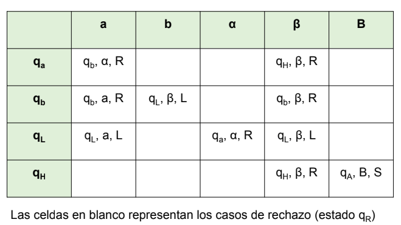

# Máquinas de Turing (MT).

## Ejercicio 1. Responder brevemente los siguientes incisos:

### 1. ¿Qué es un problema (computacional) de decisión? ¿Es el tipo de problema más general que se puede formular?

Un problema es un conjunto de frases de longitud finita que tienen asociadas frases resultantes también de longitud finita. Un problema de decisión es un problema en donde las respuestas posibles son «sí» o «no».

Un problema de decisión también se puede formalizar como el problema de decidir si una cierta frase pertenece a un conjunto dado de frases, también llamado lenguaje formal. El conjunto contiene exactamente las frases para las cuales la respuesta a la pregunta es positiva.

### 2. ¿Qué cadenas forman el lenguaje aceptado por una MT?

Un lenguaje es un conjunto de cadenas de símbolos.

Considerando la visión de MT reconocedora de un lenguaje, si a partir de la entrada w la MT M se detiene en un estado q ∈ F, se dice que M acepta w. En cambio, cuando a partir de w la MT M se detiene en un estado q ∈ (Q – F) o no se detiene, se dice que M no acepta (o rechaza) w. El conjunto de las cadenas aceptadas por la MT M es el lenguaje aceptado o reconocido por M, y se denota con L(M). Considerando la visión de MT M calculadora, sólo cuando M se detiene en un estado q ∈ F debe tenerse en cuenta el contenido final de la cinta, es decir la cadena de salida (o simplemente la salida).

### 3. En la clase 1 se hace referencia al problema de satisfactibilidad de las fórmulas booleanas (se da como ejemplo la fórmula φ = (x1 v x2) ^ (x3 ^ x4) y la asignación A = (V, F, V, V)). Formular las tres formas del problema, teniendo en cuenta las tres visiones de MT consideradas: calculadora, aceptadora o reconocedora, y generadora.

Idea general: ir armando distintas combinaciones de valores para las variables, y así tratar de ver si para alguna de ellas la operación booleana es 'true'. La asignación "A = (V, F, V, V)" nos permite saber que hay 2^n combinaciones posibles.

Si encaramos el problema con una MT tenemos:

- Calculadora: ante una cadena enviada como entrada generan un resultado. En este caso, ante la recepción de la fórmula booleana, la MT generaría la primera combinación de valores para la cual se satisface la expresión.
- Reconocedora: tratan problemas de decisión. En este caso, ante la expresión booleana dicen "si" en caso de satisfacer, y "no" en caso contrario.
- Generadora: producen todas las instancias positivas del problema. En este caso, serían todas las fórmulas que satisfacen. Por ejemplo, si la MT recibe M 'a^b', podemos afirmar que también se satisface en alguna combinación 'a^b^a'.

### 4. ¿Qué postula la Tesis de Church-Turing?

La tesis de Church-Turing formula hipotéticamente la equivalencia entre los conceptos de función computable y máquina de Turing, que expresado en lenguaje corriente vendría a ser "todo algoritmo es equivalente a una máquina de Turing"

### 5. ¿Cuándo dos MT son equivalentes? ¿Cuándo dos modelos de MT son equivalentes?

- Dos MT son equivalentes (computacionalmente) si reconocen el mismo lenguaje.
- Dos modelos de MT son equivalentes si dada una MT de un modelo existe una MT equivalente del otro.

## Ejercicio 2. Dado el alfabeto Ʃ = {a, b, c}:

### 1. Obtener el lenguaje Ʃ* y el conjunto de partes del subconjunto de Ʃ* con cadenas de a lo sumo dos símbolos. ¿Cuál es el cardinal (o tamaño) de este último conjunto?

~~~
Repaso sobre lenguajes:

*   Ʃ. Alfabeto o conjunto de símbolos:
    Ʃ = {w1, w2, w3, ...}

*   Ʃ*. Lenguaje o conjunto de cadenas de símbolos de Ʃ:
    Ʃ* = {λ, w1, w2, w3, ..., w1w1, w1w2, w1w3, ..., w1w1w1, w1w1w2, ...}
    Ʃ* es infinito. Sus cadenas son finitas. λ es la cadena vacía.

*   Todo lenguaje que consideremos será un subconjunto de Ʃ*:
    L ⊆ Ʃ*. Expresado de otra manera: L ∈ P(Ʃ*).

~~~
- Lenguaje Ʃ = { w | w ∈ {a, b, c}* }
- Conjunto de partes de Ʃ* con cadenas de a lo sumo dos símnolos = {λ, a, b, c, ab, ac, bc}
- Tamaño del último conjunto: 7

### 2. Dado el lenguaje L = {a^n b^n c^n | n ≥ 0}, obtener la intersección Ʃ* ⋂ L, la unión Ʃ* ⋃ L, el complemento de L respecto de Ʃ*, y la concatenación Ʃ . L.

* Intersección Ʃ* ⋂ L: Como Ʃ* ⊆ L, la intersección dá como resultado L.
* Unión Ʃ* ⋃ L: : Como Ʃ* ⊆ L, la unión dá como resultado L.
* Complemento de L respecto de Ʃ*: →  {ba, cab, aaccbb, aba, … }. Esta operación es equivalente a Ʃ* - L (cadenas del alfabeto que no son correctas para L)
* Concatenación Ʃ . L: → {a,b,c, aabc, babc, cabc, aaabbcc, baabbcc, caabbcc, ...}. Es como un producto cartesiano, pones cada elemento del alfabeto con cada elemento de L

## Ejercicio 3. Construir una MT (puede tener varias cintas) que acepte de la manera más eficiente posible el lenguaje L = {a^n b^n c^n | n ≥ 0}. Plantear primero la idea general.

- Idea general: Tenemos que fijarnos si el string es vacío o no. Si no es vacío, marcamos una 'a', y vamos a la derecha hasta encontrar una 'b', la cual también marcamos, y vamos a la derecha buscando una 'c'. Después volvemos a la izquierda, buscando la primera 'a' marcada, y volvemos a empezar. Si todo el string es aceptado, significa que es aceptado.

Ejemplo: http://scanftree.com/automata/turing-machine-for-a-to-power-n-b-to-power-n-c-to-power-n

* Construcción: La MT M = (Q, Ʃ, Ʃ, Γ, δ, q0, qA, qR) es:
* Q = {qa, qb, qc, qL, qH}

- qa: M busca una a
- qb: M busca una b
- qc: M busca una c
- qL: M vuelve
- qH: no hay más a.

* Ʃ = {a, b, c}
* Γ = {a, b, c, α, β, µ, B}
* q0 = qa

* Función de transición δ:

|  | a | b | c | α | β | µ | B |
| ------------- | ------------- | ------------- | ------------- | ------------- | ------------- | ------------- | ------------- |
| qa  | qb, α, R | |  | qH, α, R |  |  | qA, B, S |
| qb  | qb, a, R | qc, β, R |  |  | qH, β, R |  |  |
| qc  |  | qc, b, R | qL, µ, L  |  |  | qL, µ, R |  |
| qL  | qL, a, L | qL, b, L | qL, c, L | qL, α, R | qL, β, L | qL, µ, L |  |
| qH  |  |  |  |  | qH, β, R  | qH, µ, R  | qA, B, S |

Las celdas en blanco representan los casos de rechazo (estado qr)

## Ejercicio 4. Completar la prueba iniciada en la clase 1, de que L(M) = {a^n b^n | n ≥ 1}, siendo M la MT construida para aceptar dicho lenguaje.

Prueba de L(M) = L.

* Si w ∈ L, entonces w tiene la forma a^n b^n, con n ≥ 1

Por cómo está definida la función de transición δ, claramente a partir de w la MT M acepta w, es decir que w ∈ L(M)

• Si w ∉ L, entonces M no tiene la forma a^n b^n, con n ≥ 1. Se cumple w ∉ L(M):

- Si w = λ, M rechaza porque no está definido en δ el par (qa, B)
- Si w tiene un símbolo distinto de a o de b, M rechaza porque dicho símbolo no está considerado en δ
- Si w empieza con b, M rechaza porque no está definido en δ el par (qa, b)

* Agregadas por mi:
- Si w tiene la forma 'aba' (es decir, 'a' después de 'b'), M rechaza dado que no está definido en δ el par (qH, a)
- si w tiene más 'a' que 'b', M rechaza, dado que no está definido en δ el par (qb, B)
- Si w tiene más 'b' que 'a', M rechaza, dado que no está definido en δ el par (qH, b)

## Ejercicio 5. En la clase 1 se construyó una MT con dos cintas para aceptar el lenguaje L = {w | w ∈ {a, b}* y w es un palíndromo o “capicúa”}. Construir ahora una MT con una cinta para aceptar el mismo lenguaje (se puede considerar la idea de solución propuesta en clase).

Sea L = {w | w ∈ {a, b}* y w es un palíndromo o “capicúa”}
w es un palíndromo o “capicúa” si w = w^R, siendo w^R la cadena inversa de w
Queremos construir una MT M que acepte L

- Idea general: queremos comprobar que una palabra es palídromo. Para eso, tenemos que comparar el primer caracter y el último (siguiente y anterior a un blanco). Si hay coincidencia se marca como 'Blanco' se avanza, caso contrario se rechaza. Si todos los elementos de la cinta son blancos, entonces efectívamente la palabra es palídromo.

* La MT M = (Q, Ʃ, Γ, δ, q0, qA, qR) es:

* Q = {qx, qa, qb, qaB, qbB, qL}
- *qx* es el estado en el que se busca una 'b' o una 'a'.
- *qa* es el estado en el que se busca una 'a'.
- *qb* es el estado en el que se busca una 'b'.
- *qaB* es el estado en el que se busca el próximo espacio en blanco, habiendo encontrado antes una 'a'.
- *qbB* es el estado en el que se busca el próximo espacio en blanco, habiendo encontrado antes una 'b'.
- *qL* es el estado en el que se vuelve para encontrar el próximo caracter.

* Ʃ = {a, b}
* Γ = {a, b, B}
* q0 = qa

* Función de transición δ:

|     | a  | b  | B  |
| --- | -- | -- | -- |
| qx  |    |    |    |
| qa  |    |    |    |
| qb  |    |    |    |
| qaB |    |    |    |
| qbB |    |    |    |
| qL  |    |    |    |

## Ejercicio 6. En la clase 1 se construyó una MTN (MT no determinística) para aceptar las cadenas de la forma ha^n o hb^n, con n ≥ 0. Construir ahora una MTD (MT determinística) para lo mismo.

## Ejercicio 7. Construir una MT que calcule la resta de dos números (se puede considerar la idea de solución propuesta en la clase 1).

## Ejercicio 8. Construir una MT que genere todas las cadenas de la forma a^n b^n, con n ≥ 1 (se puede considerar la idea de solución propuesta en la clase 1).

## Ejercicio 9. Explicar (informal pero claramente) cómo simular una MT por otra que en un paso no pueda simultáneamente modificar un símbolo y moverse.

## Ejercicio 10. Explicar (informal pero claramente) cómo simular una MT por otra que no tenga el movimiento S (es decir el no movimiento).

## Ejercicio 11. Explicar (informal pero claramente) cómo simular una MT por otra que no tenga el movimiento L sino el movimiento JUMP, cuyo efecto es posicionar el cabezal en el símbolo de más a la izquierda.

## Ejercicio 12. Sea USAT el lenguaje de las fórmulas booleanas satisfactibles con exactamente una asignación de valores de verdad. P.ej. x1 ^ x2 pertenece a USAT, mientras que (x1 ^ x2) v x3 no. Indicar, justificando la respuesta, si la siguiente MTN acepta USAT:

### 1. Si la fórmula de entrada no es correcta sintácticamente, rechaza.
### 2. Genera no determinísticamente una asignación A, y si A no satisface la fórmula, rechaza.
### 3. Genera no determinísticamente una asignación A’ ≠ A. Si A’ no satisface la fórmula, acepta, y si A’ la satisface, rechaza.

#### Ayuda: Considerar p.ej. el caso en que la fórmula tiene dos asignaciones que la satisfacen.