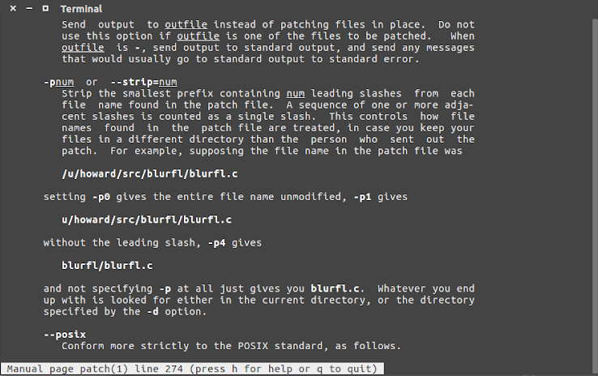

# Sistemas Operativos

## Práctica 2

## Conceptos teóricos. (Realizado por _el borre_)

_El propósito de esta primera sección de la práctica es introducir los conceptos preliminares que
necesitará el alumno, para desarrollar la actividad práctica del apartado B de la presente guía
de estudio._

### 1. ¿Qué es el _kernel_ de GNU/Linux? ¿Cuáles son sus funciones principales dentro del Sistema Operativo?

Es un programa que ejecuta programas y gestiona dispositivos de hardware. Es el encargado de que el software y el hardware puedan trabajar en conjunto. Las funciones principales son Administrar la memoria principal y administrar el uso del CPU. Es de código abierto a los Usuarios (kernel/sched.c) En un sentido estricto, la cátedra lo ve como el Sistema Operativo.

El kernel de Linux se caracteriza por ser monolítico híbrido. 
Los drivers y el código del Kernel se ejecutan en modo privilegiado. 
Lo que lo hace híbrido es la posibilidad de cargar y descargar funcionalidad a través de módulos.

El kernel de Linux es libre. Es decir que cualquier persona o entidad dispone de la libertad de poder usarlo, estudiarlo, mejorarlo y/o distribuirlo.

### 2. Indique una breve reseña histórica acerca de la evolución del _kernel_ de GNU/Linux

- En 1991 Linus Torvalds inicia la programación del kernel Linux basado en Minix[2] (Clon de Unix desarrollado por Tanembaum en 1987 con el fin de crear un SO de uso didáctico).
- El 5 de octubre de 1991, se anuncia la primera versión “oficial” de Linux (0.02).
- En 1992, con la release de la versión 0.12, se decide cambiar a una licencia GNU.
- En marzo de 1994 Torvalds considera que todos los componentes del kernel estaban suficientemente maduros y lanza la versión 1.0.
- En el año 1995 Linux se porta a arquitecturas DEC Alpha y Sun SPARC. Con el correr de los años se portó a otra decena de arquitecturas.
- En mayo de 1996 se decide adoptar a Tux como mascota oficial de Linux.
- En julio de 1996 se lanza la versión 2.0 y se define un sistema de nomenclatura. Se desarrolló hasta febrero de 2004 y terminó con la version 2.0.40. Esta versión comenzó a brindar soporte a sistemas multiprocesadores.
- En 2001 se lanza la versión 2.4 y se deja de desarrollar a fines del 2010 con la 2.4.37.11. La versión 2.4 fue la que catapultó a GNU/Linux como un sistema operativo estable y robusto.
- A fines del año 2003 se lanza la versión 2.6. Esta versión ha tenido muchas mejoras para el kernel dentro de las que se destacan soporte de threads, mejoras en la planificación y soporte de nuevo hardware.
- El 3 de agosto de 2011 se lanza la versión 2.6.39.4 anunciándose la misma desde meses previos como la última en su revisión.
- El 17 Julio de 2011 se lanza la versión 3.0. (No agrega mayores cambios. La decisión del cambio son los 20 años del SO y no superar los 40 números de revisión)
- El 12 de Abril de 2015 se lanza la versión 4.0 (Una de sus principales mejoras es la posibilidad de aplicar parches y actualizaciones si necesidad de reiniciar el SO)

### 3. Explique brevemente la arquitectura del _kernel_ de GNU/Linux teniendo en cuenta: tipo de _kernel_, módulos, portabilidad, etc.

Es un núcleo monolítico híbrido. Los drivers y el código kernel se ejecuta en modo privilegiado. Lo que lo hace hibrido es la posibilidad de cargar y descargar funcionalidades a través de módulos.

### 4. ¿Cuáles son los cambios que se introdujeron en el _kernel_ a partir de la versión 3.0?
No agrega mayores cambios.

### ¿Cuál fue la razón por la cual se cambió de la versión 2 a la 3?

La decisión del cambio son los 20 años del SO y no superar los 40 números de revisión. Es incluso totalmente compatible con Kernel 2.6

“I decided to just bite the bullet, and call the next version 3.0. It will get released close enough to the 20-year mark, which is excuse enough for me, although honestly, the real reason is just that I can no longer comfortably count as high as 40.”, Linus Torvalds, 2011

### ¿Y la razón para el cambio de la versión 3 a la 4?

Una de sus principales mejoras de la versión 4 es la posibilidad de aplicar parches y actualizaciones sin necesidad de reiniciar el SO. Agrega además soporte para nuevas CPU.

“.. Because the people have spoken, and while most of it was complete gibberish, numbers don’t lie. People preferred 4.0, and 4.0 it shall be. Unless somebody can come up with a good argument against it.”

### 5. ¿Cómo se define el versionado de los _kernel_ s de GNU/Linux?

Hasta la versión 2.6 se definida mediante 4 letras. A.B.C.D donde:

- A Denota Version. Cambia con menor Frecuencia. en 1994 (versión 1.0), en 1996 (versión 2.0), en 2011 (versión 3.0) y en en 2015 (versión 4.0). 
- B Denota revisión mayor. Antes de la versión 2.6, los números impares indicaban desarrollo, los pares producción. 
- C Denota revisión menor. Solo cambia cuando hay nuevos drivers o caracterısticas. 
- D Se utiliza cuando se corrige un grave error sin agregar nueva funcionalidad.

En el año 2011, cuando se pasó de la versión 2.6.39 a la 3.0, se eliminó el número de revisión mayor (B)[1].

Además del número de versión, se utilizaban (previo a la versión 2.6) los campos X.Y.Z, donde:
- X Indica serie principal. Cambia cuando su funcionalidad sufre un cambio muy importante. 
- Y Indica si es una versión de producción o desarrollo. 
- Z Nuevas versiones dentro de la actual. Bugfixes.

Existían dos versiones del kernel:
- Números Y pares indicaban versión en Producción (estable)
- Números Y impares indicaban versión en Desarrollo

### 6. ¿Cuáles son las razones por las cuáles los usuarios de GNU/Linux recompilan sus kernels?

Existen muchos motivos:
- Soportar nuevos dispositivos como, por ejemplo, una placa de video.
- Agregar mayor funcionalidad (soporte para algún hardware específico).
- Optimizar funcionamiento de acuerdo al sistema en el que corre.
- Adaptarlo al sistema donde corre (quitar soporte de hardware no utilizado).
- Corrección de bugs (problemas de seguridad o errores de programación).

### 7. ¿Cuáles son las distintas opciones para realizar la configuración de opciones de compilación de un _kernel_? Cite diferencias, necesidades (paquetes adicionales de software que se pueden requerir), pro y contras de cada una de ellas.

El kernel Linux se configura mediante el archivo .config. Este archivo, que reside en la raíz del directorio del kernel, contiene las instrucciones de que es lo que el kernel debe compilar.

Existen tres interfaces que permiten generar este archivo: 
- make config: modo texto y secuencial. Tedioso. 
- make xconfig: interfaz gráfica utilizando un sistema de ventanas. No todos los sistemas tienen instalado X. 
- make menuconfig: este modo utiliza ncurses, una librería que permite generar una interfaz con paneles desde la terminal. Generalmente el más utilizado.

Las herramientas mencionadas permiten: 
- Crear un archivo .config con las directivas de compilación.
- Configurar un kernel desde cero es una tarea tediosa y propensa a errores (kernels que no arranquen). Estas herramientas automatizan el proceso por nosotros.

Lo ideal es ir manteniendo el .config para no tener que configurar todo de cero. Cada nueva versión, puede valerse de un .config anterior. Por convención, es recomendable almacenar en el directorio /boot la imagen compilada del kernel junto con su .config.

### 8. Nombre al menos 5 opciones de las más importantes que encontrará al momento de realizar la configuración de un _kernel_ para su posterior compilación.

## Consultar.

### 9. Indique que tarea realiza cada uno de los siguientes comandos durante la tarea de configuración/compilación del _kernel_ :

#### (a) make menuconfig

Explicado en punto 7. Utiliza ncurses, una librería que permite generar una interfaz con paneles desde la terminal.

#### (b) make clean

El comando clean borra todos los objetos o archivos previamentes compilados. 

#### (c) make (investigue la funcionalidad del parámetro-j)

El comando make busca el archivo Makefile, interpreta sus directivas y compila el kernel. Este proceso puede durar mucho tiempo dependiendo del procesador que tengamos. El parámetro -j seguido de un número se utiliza para indicar la cantidad de threads concurrentes queremos establecer para hacer este proceso.

*Specifies the number of jobs (commands) to run simultaneously.  If there  is  more than  one -j option, the last one is effective.  If the -j option is given without an argument, make will not limit the number of jobs that can run simultaneously.*

#### (d) make modules (utilizado en antiguos kernels, actualmente no es necesario)

El comando make modules compila todos los módulos necesarios para satisfacer las opciones que hayan sido seleccionadas como módulo. Generalmente la tarea anterior se encuentra incluida en la compilación del kernel con el comando make.

#### (e) make modules_install

Los módulos compilados deben residir en el directorio /lib/modules/version-del-kernel. Al igual que en el paso anterior, el archivo Makefile tiene una regla para instalar los módulos. El parámetro modules install es una regla del Makefile que ubica los módulos del kernel recién compilado en el directorio correspondiente.

#### (f) make install

Se utiliza para instalar el kernel y otros archivos en el directorio /boot.

### 10. Una vez que el _kernel_ fue compilado, ¿dónde queda ubicada su imagen?

Al terminar el proceso de compilación, la imagen del kernel quedará ubicada en directorio-del-código/arch/arquitectura/boot/.

#### ¿dónde debería ser reubicada? ¿Existe algún comando que realice esta copia en forma automática?

Por convención, es recomendable almacenar en el directorio /boot la imagen compilada del kernel junto con su .config.

Por convención el código fuente del kernel se guarda en /usr/src. Sin embargo, como dicho directorio generalmente no tiene permisos de escritura para usuarios no privilegiados, el archivo se debe descomprimir en un directorio donde tengamos permisos, como el $HOME del usuario actual. Generalmente se crea un enlace simbólico llamado linux apuntando al directorio del código fuente que actualmente se está configurando.

```
$ ln -s /usr/src/linux-4.15 /usr/src/linux
```

### 11. ¿A qué hace referencia el archivoinitramfs? ¿Cuál es su funcionalidad? ¿Bajo qué condiciones puede no ser necesario?

Un initramfs es un sistema de archivos temporal que se monta durante el arranque del sistema. Contiene ejecutables, drivers y módulos necesarios para lograr iniciar el sistema. Luego del proceso de arranque el disco se desmonta.
Es un archivo cpio (copia entrada y salida) del archivo inicial del file System que se carga en memoria durante el startup de Linux. El programa init está pensado para completar algunas tareas antes que el archivo root file system real o final sea montado en rootfs.

### 12. ¿Cuál es la razón por la que una vez compilado el nuevo _kernel_ , es necesario reconfigurar el gestor de arranque que tengamos instalado?

Luego de instalar el kernel, para que el gestor de arranque lo reconozca simplemente deberemos ejecutar, como usuario privilegiado, el siguiente comando: ` update-grub2 `.

### 13. ¿Qué es un módulo del _kernel_? ¿Cuáles son los comandos principales para el manejo de módulos del kernel?

Un módulo del kernel es un fragmento de código que puede cargarse/descargarse en el mapa de memoria del SO (Kernel) bajo demanda.

- Permiten extender la funcionalidad del Kernel en “caliente” (sin necesidad de reiniciar el sistema). 
- Todo su código se ejecuta en modo Kernel (privilegiado).
- Cualquier error en el módulo, puede colgar el SO. 
- Permiten que el kernel se desarrolle bajo un diseño más modular. 
- Los módulos disponibles se ubican en /lib/modules/version del kernel. 
- Con el comando lsmod es posible ver que módulos están cargados.

### 14. ¿Qué es un parche del _kernel_? ¿Cuáles son las razones principales por las cuáles se deberían aplicar parches en el kernel? ¿A través de qué comando se realiza la aplicación de parches en el _kernel_?

Es un mecanismo que permite aplicar actualizaciones NO incrementales sobre la versión base. Se basa en archivos diff (archivos de diferencia), que indican qué agregar y qué quitar. Se aplican sobre la versión base. Permiten agregar funcionalidad (nuevos drivers, correcciones menores, etc.)
A veces puede resultar más sencillo descargar el archivo de diferencia y aplicarlo en vez de descargar todo el código de la nueva versión.

Un ejemplo de cómo se utiliza se puede ver en el siguiente código:

```
$ cd linux; zcat ../patch-4.15.15.gz | patch -p1
```

En este caso se puede ver que el parche se realiza mediante el comando patch con el parámetro -p, el cual se explica abajo:



Es importante mencionar que patch no puede recibir el archivo comprimido (.gz) por lo cual se utiliza previamente zcat. El cual funciona de manera similar al cat con la distinción de que descomprime lo que recibe por su entrada estándar enviando el resultado por su salida estándar.

## Ejercicio taller: Compilación del kernel Linux

_El propósito del siguiente ejercicio es el de guiar al alumno en el proceso de compilación del kernel de GNU/Linux. Si bien los siguientes ejercicios permiten agregar determinada funcionalidad al kernel, es aconsejable que los alumnos investiguen las distintas opciones con el fin de adquirir experiencia adicional. Para la realización de este taller se ha utilizado la versión 4.15 del kernel de GNU/Linux. Aquel alumno que decida utilizar otra versión deberá descargar el código fuente y los parches del kernel correspondientes de acuerdo a la versión utilizada._
A través de los siguientes pasos agregaremos nueva funcionalidad a nuestro _kernel_ de GNU/Linux asumiendo que la misma no se encuentra soportada en nuestro _kernel_ actual. Dentro de la funcionalidad a agregar se encuentran:

```
El soporte para sistemas de archivos minixyext
```
```
Soporte para la utilización de dispositivos de loopback
```
```
Actualizaremos una versión de nuestro kernel, a través de la aplicación de parches
```
Aquel alumno que utilice la máquina virtual provista por la Cátedra, no tendrá que instalar el software necesario para realizar la compilación, ya que el mismo se encuentra incluido. **El nombre del usuario a utilizar esso, y su contraseñasistemasoperativos**. Este usuario tiene permitido utilizarsudo, por lo cual para obtener privilegios derootbasta con ejecutar el comando ` sudo su `.

En caso de no utilizar la máquina virtual provista, se deberá realizar la instalación del software requerido para la instalación (librerías, compiladores, etc.)
En los comandos de ejemplo de esta práctica se verá que algunos comandos empiezan con $y otros con #. Estos símbolos representan el _prompt_ del usuario y no deben escribirse cuando se copie el comando. El símbolo $ significa que el comando debe ejecutarse con un usuario normal.
En el caso de la máquina virtual, es el usuario so. El símbolo # significa que el comando debe ejecutarse con privilegios de usuario root.

1. Descargue los archivos publicados en el sitio web de la cátedra, que se llaman _minixFS_ y _ext4FS.gz_ (en la máquina virtual provista por la cátedra se encuentran en el directorio /home/so).
    Estos archivos representan lo que se conoce como _loop device_. Básicamente son archivos regulares que pueden ser tratados como dispositivos de bloques, donde uno puede crear un sistema de archivos dentro de ellos y montarlos como si montáramos cualquier otro dispositivo de bloques como, por ejemplo, particiones de un disco rígido. La particularidad que tienen estos archivos, es que han sido formateados con distintos tipos de sistemas de archivos. El archivo denominado _minixFS_ se formateó con un tipo de sistema de archivos denominado minix. Como ya sabrán, para poder acceder a la información de este pseudo dispositivo, tendremos que soportar el sistema de archivos minix en nuestro _kernel_. Por otro lado, el archivo llamado ext4FS.gz está comprimido con la utilidad gzip (para descomprimirlo utilizaremos gzip -d ext4FS.gz). En este archivo comprimido, encontraremos otro dispositivo de bloques, formateado con el sistema de archivos extended 4 (ext4).

2. La tarea que tendremos que realizar en este ejercicio consiste en intentar montar los archivos con formato minix y ext4 que se encuentran publicado en el sitio de la cátedra y que ya hemos descargado, con el fin de poder visualizar la información que en él se encuentra. Para ello, seguiremos los siguientes pasos:

- (a) Descargaremos este archivo en algún directorio determinado de nuestro _File System_, como por ejemplo nuestro directorio personal, $HOME.
- (b) Verificaremos que dentro del directorio/mnt existan al menos dos directorios donde podamos montar nuestros pseudo dispositivos. Si no existen los directorios, los crearemos. Por ejemplo podemos utilizar el nombre/mnt/minix/y/mnt/ext4/.
- (c) A continuación montaremos nuestros dispositivos utilizando los siguientes comandos:

```
$ sudo su
# mount -t minix $HOME/minixFS /mnt/minix/ -o loop
# mount -t ext4 $HOME/ext4FS /mnt/ext4/ -o loop
```

- (d) ¿Puede explicar qué sucedió? Nota : si estás usando la máquina virtual de la cátedra, el comportamiento esperado es que los comandos anteriores fallen.

3. Descargue el código fuente del _kernel_ a compilar, el parche correspondiente a la versión a la que se quiere llevar el código fuente, arme la estructura de directorios y aplique el parche (en la máquina virtual provista por la cátedra se encuentran en el directorio/usr/src).
       
- (a) Descargar el código fuente:

```
$ cd /usr/src/
$ sudo su
# wget https://kernel.org/pub/linux/kernel/v4.x/linux-4.15.tar.xz
```

- (b) Descargar el parche correspondiente a la versión a la que quiere llevar su código fuente. Si se está usando la máquina virtual provista por la cátedra, el parche también se encuentra en/usr/src:

```
# wget https://kernel.org/pub/linux/kernel/v4.x/patch-4.15.15.xz
```

- (c) Descomprimir el kernel utilizando usuario sin privilegios de root (en la virtual, el usuario so), en un nuevo directorio en el $HOME del usuario.

```
# exit
$ mkdir $HOME/kernel/
$ cd $HOME/kernel/
$ tar xvf /usr/src/linux-4.15.tar.xz
```

- (d) Aplique el parche descargado a nuestro código fuente. Esta tarea la haremos ubicados en el directorio de nuestro código fuente y a través de la herramienta patch, verificando que no arroje errores al finalizar.

```
$ cd $HOME/kernel/linux-4.
$ xzcat /usr/src/patch-4.15.15.xz | patch -p
```

4. Configurar el código fuente del _kernel_ para su compilación. Esta tarea se realiza a través de los comandos vistos en el ejercicio 8 de la primera parte de esta práctica. En primer lugar, se deberá partir de la configuración del _kernel_ que está corriendo actualmente. Por convención, esta configuración se encuentra ubicada en/boot. La copiaremos al directorio donde se encuentra el _kernel_ parcheado.

```
$ cp /boot/config-$(uname -r) $HOME/kernel/linux-4.15/.config
```

En este caso utilizaremos la herramientamenuconfig. Para ello ejecutaremos:

```
$ cd $HOME/kernel/linux-4.
$ make menuconfig
```

Este comando pondrá en pantalla un menú de configuración del código fuente del kernel donde podremos seleccionar diversas opciones dependiendo de nuestro hardware y necesidades. Dentro de las opciones que debemos seleccionar con el fin de cumplir nuestro objetivo se encuentran:

- (a) Soporte para sistemas de archivos minix: En la opción File Systems → Miscellaneous filesystems, tendremos que seleccionar Minix fs support.
- (b) Soporte para sistemas de archivosext4: En la opción File Systems , tendremos que seleccionar The Extended 4 (ext4) filesystem.
- (c) Soporte para dispositivos de Loopback: En la opción Device Drivers → Block Devices, tendremos que seleccionar Loopback device support.

Adicionalmente puede ser necesario deshabilitar el firmado criptográfico de módulos, para ello:

- (a) Deshabilitar Module signature verification en la opción Enable loadable module support.
- (b) Deshabilitar Provide system-wide ring of trusted keys en la opción Cryptographic API → Certificates for signature checking.

Estas últimas opciones deben deshabilitarse si al intentar compilar recibimos el error:

make[2]: *** No rule to make target ’debian/certs/benh@debian.org.cert.pem [...]’.

La forma de movernos a través de este menú es utilizando las flechas del cursor, la tecla Enter y la barra espaciadora. A través de esta última podremos decidir sobre determinada opción si la misma será incluida en nuestro kernel, si será soportada a través de módulos, o bien si no se dará soporte a la funcionalidad (<*>,<M>,<>respectivamente). Una vez seleccionadas las opciones necesarias, saldremos de este menú de configuración a través de la opciónExit, guardando los cambios.

5. Luego de configurar nuestro _kernel_ , nos dispondremos a realizar la compilación del mismo y sus módulos.
    Para realizar la compilación deberemos ejecutar:
    ``` $ make -j **X** ```
    **X** deberá reemplazarse por la cantidad de procesadores con los que cuente su máquina. En máquinas con más de un procesador o núcleo, la utilización de este parámetro puede acelerar mucho el proceso de compilación, ya que ejecuta X jobs o procesos para la tarea de compilación en forma simultánea. Este comando debemos ejecutarlo ubicados dentro del directorio donde se encuentra el código fuente del kernel descargado ($HOME/kernel/linux-4.15).

    La ejecución de este último puede durar varios minutos, o incluso horas, dependiendo del tipo de hardware que tengamos en nuestra PC y las opciones que hayamos seleccionado al momento de la configuración. Una vez finalizado este proceso, debemos verificar que no haya arrojado errores. En caso de que esto ocurra debemos verificar de qué tipo de error se trata y volver a la configuración de nuestro kernel para corregir los problemas. Una vez corregidos tendremos que volver a compilar nuestro kernel. Previo a esta nueva compilación debemos correr el comandomake cleanpara eliminar pasos inconclusos de compilaciones anteriores.

6. Finalizado este proceso, debemos reubicar las nuevas imágenes en los directorios correspondientes, instalar los módulos, crear una imageninitramfsy reconfigurar nuestro gestor de arranque.

- (a) En primer lugar, para realizar la instalación de los módulos ejecutaremos:
         ``` $ sudo make modules_install ```
    Recordar que debemos estar ubicados en el directorio$HOME/kernel/linux-4.15. Este comando copiará los módulos compilados al directorio/lib/modules/4.15.15.

- (b) Para reubicar la imagen del _kernel_ disponemos de al menos dos métodos:

1. Utilizar el siguiente comando:

```
$ sudo make install
```

Este comando reubicará todos los archivos creados durante el proceso de compilación. Este es el método recomendado puesto que, entre otros detalles, no sobre-escribirá ningún archivo en caso de que el kernel que estemos instalando tenga la misma versión que el que está corriendo.

2. Este método consiste en hacer lo mismo que el anterior, pero de forma manual. Se deben realizar la copia manual de cada uno de los archivos creados. Para ello debemos ejecutar los siguientes comandos:

```
$ sudo su
# cp -i $HOME/kernel/linux-4.15/arch/i386/boot/bzImage /boot/vmlinuz-4.15.
# cp -i $HOME/kernel/linux-4.15/System.map /boot/System.map-4.15.
# cp -i $HOME/kernel/linux-4.15/.config /boot/config-4.15.
```

El primer comando copiará la imagen del kernel , el segundo copiará el archivo de mapa de símbolos correspondiente a la nueva imagen del kernel. El último comando nos permitirá mantener una copia del archivo de configuración con el cual fue compilado nuestro kernel. Si bien no es necesario mantener este último archivo, es recomendable hacerlo, con el fin de mantener el orden y una documentación de las opciones de compilación utilizadas en la imagen compilada.

- (c) Si en el inciso anterior se utilizó la opción demake install, entonces podremos saltear este paso. De lo contrario, para la creación de la imagen initramfs utilizaremos el comando:

```
# mkinitramfs -o /boot/initrd.img-4.15.15 4.15.
```

- (d) El último paso previo a realizar la prueba de nuestra imagen del kernel , es reconfigurar nuestro gestor arranque de manera tal que podamos bootear con la nueva imagen. Suponiendo que el gestor de arranque que tenemos instalado es GRUB en su versión 2, ejecutaremos el comando:

```
# update-grub
```

Este comando se encargará de agregar las entradas correspondientes en el archivo de configuración/boot/grub/grub.cfg. Nuevamente, si utilizamos ` make install ` para instalar el kernel, entonces es posible saltear este paso.

7. Como último paso, a través del comandoreboot, reiniciaremos nuestro equipo y probaremos el nuevo _kernel_ recientemente compilado. Al momento de cargarse nuestro gestor de arranque, veremos una nueva entrada que hace referencia al nuevo _kernel_. Para _bootear_, seleccionamos esta entrada y verificamos que el sistema funcione correctamente. En caso de que el sistema no arranque con el nuevo _kernel_ , tendremos la opción de volver a _bootear_ con nuestro _kernel_ anterior para corregir los errores y realizar una nueva compilación.

8. Repita el procedimiento del inciso dos. ¿Qué sucede ahora?

Como nuestro kernel tiene soporte para este tipo de File System , entonces, ingresando a /mnt/minix, encontraremos la información contenida en este pseudo dispositivo. Nos encontraremos con una situación similar al querer montar el sistema de archivos ext4.


