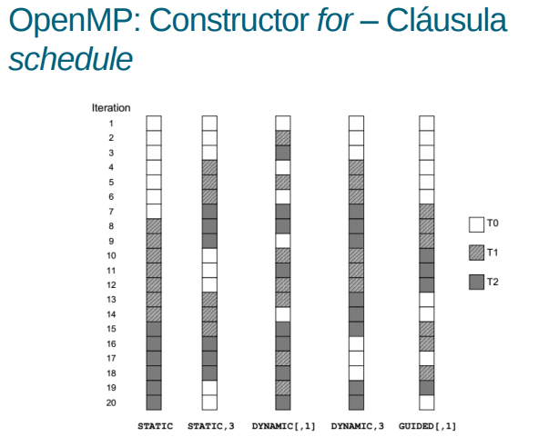

# Sistemas Paralelos 2018

# Práctica Nro. 3 - Programación con OpenMP

#### *Esta práctica cuenta con una entrega obligatoria que los alumnos deberán entregar en grupos de dos personas.*

## 1. El programa ejercicio1.c inicializa una matriz de N * N de la siguiente manera: A[i,j]=i*j, para todo i,j=0..N- 1. Compilar y ejecutar. ¿Qué problemas tiene el programa? Corregirlo.

El problema que tiene el programa es que al momento de asignar valores a la matriz está intentando hacer privada la variable ` i ` del ` for ` anterior. Al usar la cláusula ` private ` cada hilo crea una copia local de ` i `, la cual nunca se modifica después, y provoca que el resultado sea incorrecto.

Para solucionar el problema, basta con modificar el siguiente bloque de código:

```
...

for(i=0;i<N;i++){
   #pragma omp parallel for shared(A) private(i,j)
   for(j=0;j<N;j++){
		A[i*N+j]=i*j;
   }
}   

...

```

Por el siguiente:

```
...

#pragma omp parallel for shared(A) private(i,j)
for(i=0;i<N;i++){
   for(j=0;j<N;j++){
		A[i*N+j]=i*j;
   }
}   

...

```

## 2. Analizar y compilar el programa ejercicio2.c. Ejecutar varias veces y comparar los resultados de salida para diferente número de threads ¿Cuál es el problema? Corregirlo.

Al ejecutar con distinta cantidad de hilos el resultado es distinto.

## Duda. No encuentro otra solución que no sea sacarle el paralelismo

## 3. El programa matrices.c realiza la multiplicación de 2 matrices cuadradas de N*N (C=AxB). Utilizando _pragma parallel omp for_ Paralelizarlo de dos formas:

### a. Repartiendo entre los threads el cálculo de las filas de C. _Es decir, repartiendo el trabajo del primer for._

### b. Repartiendo el cálculo de las columnas de cada fila de C. _Es decir, repartiendo el trabajo del segundo for._

### Comparar los tiempos de ambas soluciones variando el número de threads.

## 4. El programa traspuesta.c calcula la transpuesta de una matriz triangular de N*N. Compilar y ejecutar para 4 threads comparándolo con el algoritmo secuencial. El programa tiene un problema, describir de que problema se trata. ¿Qué cláusula usaría para corregir el problema? Describir brevemente la cláusula OpenMP que resuelve el problema y las opciones que tiene. Corregir y ejecutar de nuevo comparando con los resultados anteriores.

El problema que tiene el código es la mala distribución de la carga de trabajo. Para solucionarlo, podemos usar la cláusula ` schedule `. La siguiente explicación fue extraida de la teoría de OpenMP:

- schedule(política [,chunk]): especifica cómo se distribuyen las iteraciones entre los hilos.

• static: divide en bloques de chunk iteraciones y las asigna en forma round-robin. Cuando chunk no se especifica, se dividen las iteraciones en bloques de tamaño aproximado.

• dynamic: divide en bloques de chunk iteraciones y las asigna bajo demanda. Cuando chunk no se especifica, las iteraciones son asignadas de a 1.

• guided: basado en dynamic pero decrementando chunk a medida que avanza el bucle. Cuando chunk=1, el bloque de iteraciones se asigna en forma proporcional a las iteraciones pendiente y los hilos que integran el bucle. Cuando chunk = k > 1, el bloque se asigna de igual manera pero nunca será menor a k.

• auto: se delega la elección al compilador o al sistema

• runtime: la planificación la determina la variable de entorno OMP_SCHEDULE



Al estar trabajando con una matriz triangular nos conviene el schedule dynamic. Pasamos de tener este código:

```
#pragma omp parallel default(none) private(i,j,temp,timetick,tid) shared(A,N)
{ 
 tid= omp_get_thread_num();
 timetick = dwalltime();
 #pragma omp for private(i,j,temp) nowait
  for(i=0;i<N;i++){
   for(j=i+1;j<N;j++){
		temp = A[i*N+j];
		A[i*N+j]= A[j*N+i];
		A[j*N+i]= temp;
  
   }
  }   
    printf("Tiempo en segundos para el thread %d: %f \n", tid,dwalltime() - timetick);
}
```

A tener este:

```
#pragma omp parallel default(none) private(i,j,temp,timetick,tid) shared(A,N)
{ 
 tid= omp_get_thread_num();
 timetick = dwalltime();
 #pragma omp for private(i,j,temp) schedule(dynamic) nowait
  for(i=0;i<N;i++){
   for(j=i+1;j<N;j++){
		temp = A[i*N+j];
		A[i*N+j]= A[j*N+i];
		A[j*N+i]= temp;
  
   }
  }   
    printf("Tiempo en segundos para el thread %d: %f \n", tid,dwalltime() - timetick);
}
```

## 5. El programa mxm.c realiza 2 multiplicaciones de matrices de M * M (D=A * B y E=C * B). Paralelizar utilizando secciones de forma que cada una de las multiplicaciones se realice en una sección y almacenar el código paralelo como mxmSections.c. Compilar y ejecutar sobre diferente número de threads.

### Probar con 2 threads. Luego con 4 threads ¿Se Consigue mayor speedup al incrementar la cantidad de threads? ¿Por qué?

No, no se consigue mayor speedup. Las sections son útiles para código no iterativo. En este caso, el código es iterativo. Cada section es ejecutada por un único hilo. Al haber solo dos sections, poner más de dos hilos es innecesario.

Si corremos el código con un solo hilo, el tiempo aproximado es: 22.510408.
Si corremos el código con dos hilos, el tiempo aproximado es: 11.277496.

Luego ya no se notan diferencias por lo explicado previamente.

**Pautas:**

##### Compilar en Linux gcc:
```
gcc -fopenmp -o salidaEjecutable archivoFuente
```

#### Ejecutar:

##### *Ejercicio 1:*
```
./ejercicio1 N cantidadDeThreads
```

##### *Ejercicio 2:*

```
# Compilar utilizando la opción –lm:
gcc -fopenmp -o salidaEjecutable archivoFuente -lm
./ejercicio2 N cantidadDeThreads
```

##### *Ejercicio 3:*

```
./matrices N cantidadDeThreads
```

##### *Ejercicio 4:*

```
./traspuesta N cantidadDeThreads
```

##### *Ejercicio 5:*

```
./mxm N cantidadDeThreads_
```

